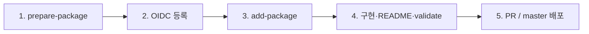

# 패키지 추가 가이드 (유지보수)

`@watcha-authentic/*` 패키지를 **처음 레지스트리에 등록**하고, 모노레포 `packages/`에 넣어 **CI로 배포**하기까지의 절차입니다.  
유지보수 담당자(레지스트리·CI 권한 보유) 기준으로 작성했습니다.

## 관련 문서

| 문서                                                                                                                          | 용도                                         |
| ----------------------------------------------------------------------------------------------------------------------------- | -------------------------------------------- |
| [bistro-house npm registry](https://www.notion.so/watcha/bistro-house-npm-registry-2f1a2845fc0f80c7a4c9c2c2b7907d1d) (Notion) | OIDC(Trusted Publishing), org 권한           |
| [PACKAGE_README_GUIDE.md](./PACKAGE_README_GUIDE.md)                                                                          | `packages/<name>/README.md` 형식             |
| [PACKAGE_DEPS_AND_BUILD.md](./PACKAGE_DEPS_AND_BUILD.md)                                                                      | `dependencies` / `peerDependencies` · tsdown |
| [MAINTAINER_GUIDE.md](./MAINTAINER_GUIDE.md)                                                                                  | 유지보수 인덱스 (CI·배포·스크립트)           |
| [../README.md](../README.md)                                                                                                  | 저장소 개요 · 패키지 목록 · 기여 시작        |

## 전제

- Node.js `^24`, pnpm `^9.9.0`
- npm **`@watcha-authentic` org에 publish 권한**이 있는 계정
- 로컬 배포·`prepare-package`는 **`npm login`** (Security Key). CI는 **OIDC** (`npm login` 아님)
- Granular Access Token(Bypass 2FA)은 **일회성 관리 작업**용이며, 일상 스크립트 실행에는 쓰지 않습니다

## 절차 요약

아래 순서대로 진행합니다. **2번(OIDC)은 `master` merge 전**에 끝내야 CI 배포가 성공합니다.



| 단계 | 작업                                     | 완료 기준                                              |
| ---- | ---------------------------------------- | ------------------------------------------------------ |
| 1    | `pnpm prepare-package <name>`            | npm에 `@watcha-authentic/<name>@0.0.1` 존재            |
| 2    | Notion에 따라 **Trusted Publisher** 등록 | `publish.yml`로 CI publish 가능                        |
| 3    | `pnpm add-package ...`                   | `packages/<name>/` 스캐폴드 생성                       |
| 4    | 구현 · README · 로컬 검증                | `pnpm validate --filter=@watcha-authentic/<name>` 성공 |
| 5    | PR → `master`                            | `validate-pr` 통과 후 Lerna-Lite 정식 배포             |

카나리로 tarball·설치를 먼저 검증할 때는 **1번 이후·5번 이전**에 `pnpm publish:canary <name>`(로컬 `npm login`)을 쓸 수 있습니다.

---

## 1. 레지스트리에 패키지 이름 확보 (`prepare-package`)

npm에 **빈 패키지**를 한 번 올려 스코프 아래 **패키지 이름을 선점**합니다. 이후 실제 코드는 모노레포에서 빌드·배포합니다.

### 실행

```bash
npm login   # @watcha-authentic publish 권한 계정 (Security Key)
pnpm prepare-package <package-name>
# 예: pnpm prepare-package react-foo
#     → @watcha-authentic/react-foo@0.0.1
```

- 스크립트: [prepare-package.js](../project-attachment/script/prepare-package/prepare-package.js)
- `npm whoami` 실패 시 즉시 종료 (login 필요)
- 첫 publish 버전은 항상 **`0.0.1`** (템플릿 고정)

### 로컬 파일

- publish는 `project-attachment/script/prepare-package/temp-package/` 임시 디렉터리에서만 수행합니다.
- **성공·실패와 관계없이** 스크립트 종료 시 `temp-package/`는 삭제됩니다. 모노레포 `packages/`에는 **아무 것도 생성되지 않습니다**.

### 버전

- npm 레지스트리: **`0.0.1`** (빈 placeholder)
- `add-package` 스캐폴드 `package.json`: **`0.0.0`** (개발 초기값)
- `master` merge 후 Lerna-Lite가 conventional commit 기준으로 **다음 버전**을 publish합니다 (`0.0.1` 위에 덮어쓰지 않음).

### 자주 나는 오류

| 메시지                                                     | 원인                                                         | 대응                                                            |
| ---------------------------------------------------------- | ------------------------------------------------------------ | --------------------------------------------------------------- |
| `npm login이 필요` / whoami 실패                           | 미로그인                                                     | `npm login`                                                     |
| `Cannot publish over previously published version "0.0.1"` | 같은 이름으로 `0.0.1` 이미 publish됨                         | 레지스트리 등록은 완료된 상태 → **2번(OIDC) 또는 3번으로 진행**. 재실행 불필요 |
| `404` / permission                                         | org·스코프 publish 권한 없음, 또는 `~/.npmrc` 토큰만 사용 중 | org 멤버·권한 확인, 일상 작업은 **토큰 제거 후 `npm login`**    |

`prepare-package`는 **CI에서 돌지 않습니다**. 로컬 전용입니다.

---

## 2. npm OIDC(Trusted Publishing)

`master` merge 시 [publish.yml](../.github/workflows/publish.yml)이 `lerna publish`를 실행합니다. **패키지별 Trusted Publisher가 없으면 CI가 실패**합니다.

- 설정 절차: **[bistro-house npm registry](https://www.notion.so/watcha/bistro-house-npm-registry-2f1a2845fc0f80c7a4c9c2c2b7907d1d)** (Notion)
- Publisher 예: `frograms` / `bistro-house` / **`publish.yml`**
- 패키지당 Publisher **1개**, 워크플로 파일명도 **1개**만 등록 가능 ([npm 문서](https://docs.npmjs.com/trusted-publishers/))

1번(`prepare-package`)과 **3번(`add-package`) 사이**에 진행하면 됩니다. **`master` merge 전**에는 반드시 완료하세요.  
로컬 `prepare-package`·`add-package`·구현 작업에는 OIDC가 필요하지 않습니다.

---

## 3. `packages/<name>/` 스캐폴딩 (`add-package`)

`lerna.json`의 `packages: ["packages/*"]`에 따라 **디렉터리만 추가하면** Lerna-Lite·pnpm 워크스페이스에 자동 포함됩니다.

**1번과 동일한 `<name>`**을 써야 `@watcha-authentic/<name>`이 레지스트리·`package.json`·폴더명과 일치합니다.

### `pnpm add-package` (권장)

모노레포 convention에 맞춘 스캐폴딩은 **저장소 루트**에서 실행합니다. 내부적으로 워크스페이스의 [`@watcha-authentic/common-cli`](../packages/common-cli/README.md) `create-package`(dev)를 호출합니다.

```bash
pnpm add-package <type> <project-name> <project-description> [options...]
```

| 인자                  | 설명                                       |
| --------------------- | ------------------------------------------ |
| `type`                | `lib` · `react` · `react-vite`             |
| `project-name`        | 폴더명·npm 패키지 접미사 (kebab-case 권장). **1번 `prepare-package`와 동일** |
| `project-description` | `package.json` `description`               |

#### `--type` 선택

| `type`       | Build                        | React peer           | 언제 쓰나                          |
| ------------ | ---------------------------- | -------------------- | ---------------------------------- |
| `lib`        | tsdown (`platform: node`)    | 없음                 | React 없는 TypeScript 라이브러리   |
| `react`      | tsdown (`platform: neutral`) | `react`, `react-dom` | hook·컴포넌트 npm 라이브러리       |
| `react-vite` | Vite library mode            | `react`, `react-dom` | Vite 기반 React 라이브러리         |

스크립트가 고정하는 값: `@watcha-authentic` scope, 출력 경로 `packages/<project-name>/`, MIT 라이선스, 배포용 `package.json` variant, 저장소·author 메타.  
4번째 인자부터는 `create-package` 옵션을 그대로 넘길 수 있습니다 (`--yes`, `--without-install` 등).

```bash
# TypeScript 라이브러리 (tsdown)
pnpm add-package lib my-pkg "My package description"

# React 라이브러리 (tsdown + React peer)
pnpm add-package react my-react-pkg "React hook library"

# Vite library mode (React peer)
pnpm add-package react-vite my-vite-pkg "Vite-based React package"

# install 생략 후 루트에서 한 번에 install
pnpm add-package lib my-pkg "My package description" --yes --without-install
pnpm install
```

- 스크립트: [add-package.sh](../project-attachment/script/add-package.sh)
- 생성 위치: `packages/<project-name>/`
- 템플릿·옵션 상세: `pnpm --filter=@watcha-authentic/common-cli dev create-package --help`

수동으로 디렉터리를 만들 때는 **4번**의 최소 구성을 참고하세요.

### 참고할 기존 패키지

| 유형                      | 참고 경로                                              |
| ------------------------- | ------------------------------------------------------ |
| TypeScript 라이브러리     | `packages/` 내 tsdown 기반 lib (신규 스캐폴드와 동일 패턴) |
| React 라이브러리 (tsdown) | `packages/react-event-callback/`                       |
| Vite React 라이브러리     | `add-package react-vite` 스캐폴드 · [common-cli README](../packages/common-cli/README.md) |
| ESLint/Prettier 설정      | `packages/eslint-config/`, `packages/prettier-config/` |

---

## 4. 구현 · README · 로컬 검증

스캐폴드 후 실제 코드·문서를 채우고 검증합니다.

### 최소 구성 (React 라이브러리 예)

```
packages/<name>/
├── package.json      # name, exports, scripts(test, lint, build, typecheck)
├── tsconfig.json
├── tsdown.config.mts
├── eslint.config.mts
├── src/index.ts
├── README.md
├── LICENSE
└── project-attachment/post-build.sh   # 필요 시 (기존 패키지와 동일 패턴)
```

`package.json`에서 맞출 항목:

- `name`: `@watcha-authentic/<name>` (**1번 `prepare-package`와 동일**)
- `publishConfig.access`: `public`
- `repository` / `homepage`: 이 저장소·패키지 경로
- `scripts`: `test`, `lint`, `build`, `typecheck` — 루트 `pnpm validate`가 turbo로 일괄 실행
- `files`: 배포 tarball에 넣을 경로 (보통 `dist`)

종속성·빌드 규칙은 [PACKAGE_DEPS_AND_BUILD.md](./PACKAGE_DEPS_AND_BUILD.md)를 따릅니다.

### README

[PACKAGE_README_GUIDE.md](./PACKAGE_README_GUIDE.md)에 맞춰 `packages/<name>/README.md`를 작성합니다.

- 섹션 제목(앵커)은 **영어**
- `package.json`의 `description`, `peerDependencies`와 내용 일치
- Usage 예제는 **실제 export** 기준

### 로컬 확인

```bash
pnpm install
pnpm validate --filter=@watcha-authentic/<name>
pnpm build --filter=@watcha-authentic/<name>
```

### playground (선택)

UI·동작을 눈으로 보려면 [apps/playground/package.json](../apps/playground/package.json)에 `workspace:*` 의존성을 추가합니다. 필수는 아닙니다.

---

## 5. PR · CI · 정식 배포

1. PR 생성 → [validate-pr.yml](../.github/workflows/validate-pr.yml)에서 `pnpm validate` (모노레포 전체)
2. 리뷰 후 `master` merge (**2번 OIDC 완료 필수**)
3. [publish.yml](../.github/workflows/publish.yml) `publish-latest` job: validate → build → `lerna publish` (conventional commits, independent versioning)

버전은 **패키지별로** 올라갑니다 (`lerna.json` `version: independent`).

### 배포 전 검증 (선택)

```bash
npm login
pnpm publish:canary <name>
# 설치: pnpm add @watcha-authentic/<name>@canary
```

---

## 체크리스트

- [ ] `npm login` 후 `pnpm prepare-package <name>` 성공 (또는 해당 이름 `0.0.1` 이미 존재)
- [ ] Notion: Trusted Publisher(`publish.yml`) 등록 (**master merge 전**)
- [ ] `pnpm add-package ...` — `<project-name>`이 1번과 동일
- [ ] 구현 완료, `pnpm validate --filter=@watcha-authentic/<name>` 통과
- [ ] `packages/<name>/README.md` ([가이드](./PACKAGE_README_GUIDE.md) 준수)
- [ ] PR CI green → `master` merge
- [ ] npm에 정식 버전·`latest` 태그 반영 확인

---

## FAQ

**Q. `prepare-package` 없이 `add-package`만 하면?**  
A. CI `lerna publish` 시 npm에 패키지가 없으면 실패할 수 있습니다. **1번 레지스트리 선등록**을 먼저 진행하세요.

**Q. OIDC 없이 `master` merge하면?**  
A. [publish.yml](../.github/workflows/publish.yml)의 `lerna publish`가 Trusted Publisher 인증에서 실패합니다. **2번을 merge 전에** 끝내세요.

**Q. 패키지 이름을 바꾸고 싶다면?**  
A. npm 패키지 이름 변경은 사실상 불가에 가깝습니다. 새 이름으로 `prepare-package` + `add-package`가 필요합니다.

**Q. `prepare-package-registry` 스크립트는?**  
A. `package.json` scripts에 연결되어 있지 않으며, 운영 경로는 **`prepare-package`** 입니다.
